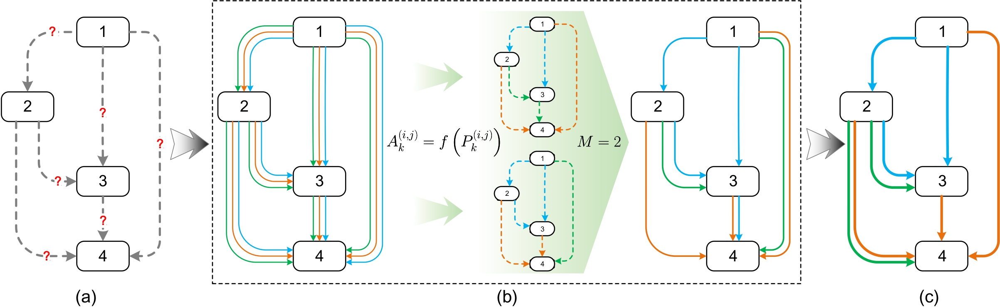

# DATA-NAS
Codes for DATA: Differentiable ArchiTecture Approximation.

<div align="center">
  
</div>

## Requirements
```
python == 2.7 
pytorch == 1.0
```
## Searching 
```
python train_search.py
```

## Evalution 
```
python train_gumbel.py --your architecture
```

## Bibtex
```
@article{chang2019data,
  title={Data: Differentiable architecture approximation},
  author={Chang, Jianlong and Guo, Yiwen and MENG, GAOFENG and XIANG, SHIMING and Pan, Chunhong and others},
  journal={Advances in Neural Information Processing Systems},
  volume={32},
  pages={876--886},
  year={2019}
}
```